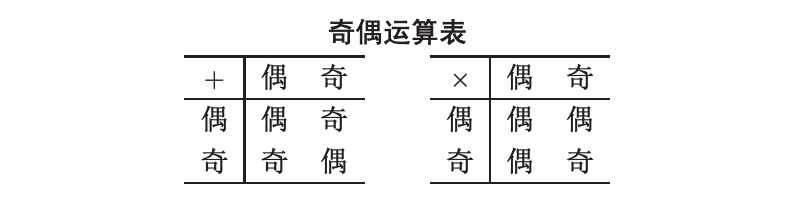

# 《数学的天空》小组讨论题二

第十组：左翊昆，阿尔乔姆，黎志宏，王宇恒，徐惠东。

`2022.3.16`

## 目录

- [目录](#目录)
- [题目重述](#题目重述)
- [建模与求解](#建模与求解)
- [思考与拓展](#思考与拓展)
- [分工与合作](#分工与合作)

## 题目重述

> 研究整系数多项式环 $\mathbb{Z}[x]$ 中的奇偶性，并将此推广至 $n$ 元整系数多项式环 $\mathbb{Z}[x_1, \cdots, x_n]$.

首先，我们明确一元整系数多项式的定义为：

$$
\mathbb{Z}[x] = a_nx^n + a_{n - 1}x^{n - 1} + \cdots + a_1x^1 + a_0
$$

其中 $n$ 是大于 $0$ 的自然数，而 $a_0, a_1, \dots, a_{n - 1}, a_n$ 都是整数。

同理，多元整系数多项式就是有多个不同的 $x$ 构成的整系数多项式，其中也包含交叉项等。

我们要研究整系数多项式环的奇偶性，可以通过证明整系数多项式环具有奇偶性，即我们需要在整系数多项式环上构造一种满足 **加法** 和 **乘法** 的运算（如下表）。

## 建模与求解

### 一种简单的分类：以常数项定奇偶

因为奇偶性最初就是定义在整数上的，所以很容易想到，我们以 **整系数多项式的常数项** 作为其奇偶性的唯一标准是可行的。即 $\mathbb{Z}(x)$ 的奇偶性取决于常数项 $a_0$ 的奇偶性，如果常数项 $a_0$ 为奇数则 $\mathbb{Z}(x)$ 为奇，如果常数项 $a_0$ 为偶数则 $\mathbb{Z}(x)$ 为偶。

由于在整系数多项式上的加法和乘法中，常数项的结果始终只和原来的常数项相关，因此很容易验证其满足加法和乘法的运算。

### 一些改进：以常数项之和定奇偶

只考虑常数项过于局部，忽略了整系数多项式的许多项的信息，因此我们将常数项做出延伸，以 **整系数多项式的项系数之和** 来判定其奇偶性。然后我们需要对 **加法** 和 **乘法** 运算进行验证。

不妨假设整系数多项式 $f_1(x)$ 的系数和为 $\sum^n_{i = 0} a_i$，$f_2(x)$ 的系数和为 $\sum^m_{j = 0} b_j$。

不难得到 $f_1(x) + f_2(x)$ 的系数和为 $\sum^n_{i = 0} a_i + \sum^m_{j = 0} b_j$，$f_1(x)f_2(x)$ 的系数和为 $\sum^n_{i = 0} a_i \times \sum^m_{j = 0} b_j$。

即多项式运算与系数和运算等价，满足加法和乘法运算规则。

### 一些发现：融入自变量

我们神奇地发现，如果以常数项作为判定标准实际上就是考虑 $f(0)$ 的奇偶性，而以项系数之和作为判定标准实际上就是考虑 $f(1)$ 的奇偶性，于是，我们试图推广到考虑任意的 $x$ 对应的 $f(x)$ 的奇偶性。

我们发现，若 $x$ 为奇数，则 $f(x) = \sum^n_{i = 0} a_i \times x^i$ 与 $f(1) = \sum^n_{i = 0} a_i \times 1^i$ 同奇偶。若 $x$ 为偶数，则 $f(x) = \sum^n_{i = 0} a_i \times x^i$ 与 $f(0) = \sum^n_{i = 0} a_i \times 0^i$ 同奇偶。

因此，我们可以将 $x$ 从 $0$ 和 $1$ 推广至全体整数。若 $x$ 是奇数，则 $f(x)$ 以 **项系数之和** 来判定奇偶，若 $x$ 是偶数，则 $f(x)$ 以 **常数项** 来判定奇偶。

所以，$f(x)$ 的奇偶性可以通过以下方法来定义：

**选择任意的 $x_0 \in \mathbb{Z}$，若 $f(x_0)$ 是奇数，则 $f(x)$ 定义为奇。若 $f(x_0)$ 是偶数，则 $f(x)$ 定义为偶。**

于是，我们将整系数多项式的奇偶通过放到 $x$ 所在的 $\mathbb{Z}$ 环上来定义。

### 最终结果：推广到 $n$ 元

我们接着考虑 $\mathbb{Z}[x_1, \cdots, x_n]$，由上述讨论可知：

$\forall x \in \mathbb{Z}$，可以分奇偶等价放到 $x = 1$ 和 $x = 0$ 上计算。

于是，我们仅需考虑 $f(x_1, \cdots, x_n) \quad x_1, \cdots, x_n \in \{0, 1\}$ 的合理性。设 $\vec{x} = {x_1, \cdots, x_n}$，对任意的 $x_i$ 取任意的 $0$ 或者 $1$，则我们可以将 $f_1(\vec{x})$ 写成 部分系数和 $\sum^{m_1}_{i = 1} a_{k_i}$ 和 $0$，$f_2(\vec{x})$ 写成 部分系数和 $\sum^{m_2}_{j = 1} b_{k_j}$ 和 $0$ 的形式。则

$$
\begin{aligned}
f_1(\vec{x}) + f_2(\vec{x}) &= \sum^{m_1}_{i = 1} a_{k_i} + \sum^{m_2}_{j = 1} b_{k_j} \\
f_1(\vec{x}) \times f_2(\vec{x}) &= \sum^{m_1}_{i = 1} a_{k_i} \times \sum^{m_2}_{j = 1} b_{k_j} + \sum^{m_1}_{i = 1} a_{k_i} \times 0 + \sum^{m_2}_{j = 1} b_{k_j} \times 0 + 0 \times 0 \\
&= \sum^{m_1}_{i = 1} a_{k_i} \times \sum^{m_2}_{j = 1} b_{k_j}
\end{aligned}
$$

通过上述讨论，可知 $f(x)$ 在 $\mathbb{Z}^n$ 上同样可用 $\forall x$ 的合理取值来定义奇偶，即 $\mathbb{Z}[x_1, \cdots, x_n]$ 奇偶性可通过如下方式定义：

**选择任意的 $\vec{x} \in \mathbb{Z}^n$，若 $f(\vec{x})$ 为奇，则 $f(\vec{x})$ 定义为奇。若 $f(\vec{x})$ 为偶，则 $f(\vec{x})$ 定义为偶。**

于是我们将整系数多项式的奇偶性放到了 $\mathbb{Z}^n$ 环上来定义。

## 思考与拓展

正如问题所示，由一元推广到 $n$ 元，数学是 **由浅入深** 的过程，我们的建模解答也遵循了这个规律。从奇偶性最初定义在整数上出发，逐步定义出一元整系数多项式的奇偶性，然后再推广至多元整系数多项式上，最后贯穿起来形成流畅的逻辑。

## 分工与合作

第十组 **左翊昆**、**阿尔乔姆** 和 **黎志宏** 讨论了思路并由 **左翊昆** 详细整理出完整的逻辑，**徐惠东** 撰写了论文，**王恒宇** 参与了思路讨论与论文完善，感谢第十组全体同学的付出。

