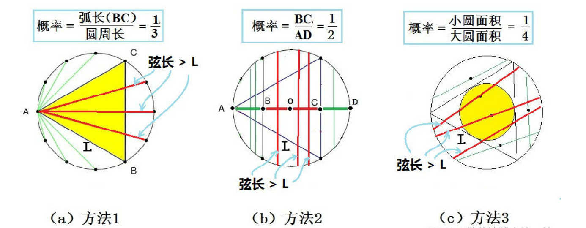
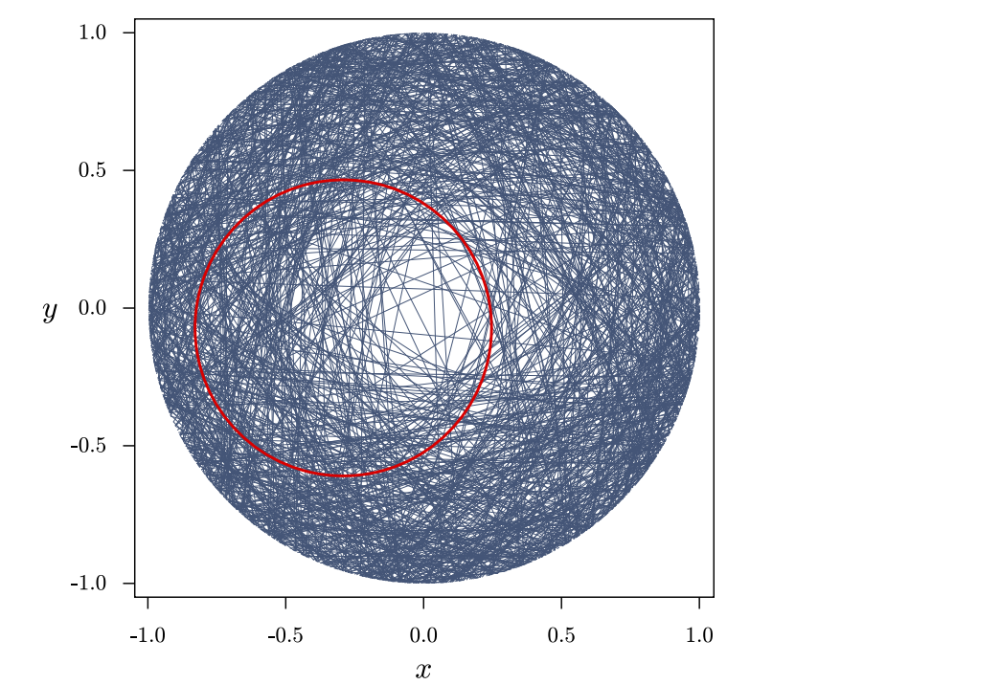

# 贝特朗悖论

## 目录

- [目录](#目录)
- [分工](#分工)
- [贝特朗悖论是什么](#贝特朗悖论是什么)
- [随机半径法脱颖而出](#随机半径法脱颖而出)
- [三种解法全错了](#三种解法全错了)
- [白马非马](#白马非马)
- [悖论的终极奥秘](#悖论的终极奥秘)
- [参考文献](#参考文献)

## 分工

1. 引出讨论话题，重点介绍贝特朗悖论的三个解法，可以用 [动画演示贝特朗悖论](http://web.mit.edu/tee/www/bertrand/problem.html)，目的是让完全不知道的同学对贝特朗悖论有初步概念。
2. 基于论文 [Bertrand paradox (probability)](https://www.uio.no/studier/emner/matnat/math/MAT4010/v17/notater/w-bertrand-paradox-%28probability%29.pdf) 阐述为什么 **随机半径解法** 更合理。（关键在于要保证无论圆的 **大小** 和 **位置** 在哪，都能保证弦的分布是均匀的）。
3. 基于论文 [Bertrand’s Paradox Revisited: Why Bertrand’s ‘Solutions’ Are All Inapplicable](https://ieeexplore.ieee.org/abstract/document/8181958) 阐述为什么贝特朗给出的三种解法均不正确。（关键在于弦的选取方法在贝特朗的三种解法中都是从限定的无限集合中选取，而没有真正做到 **随机选取**，正因如此贝特朗悖论更加难以求解）。
4. 轻松一刻：完整讲述 [白马非马的原始故事](https://baike.baidu.com/item/%E7%99%BD%E9%A9%AC%E9%9D%9E%E9%A9%AC/464) 并适当引出悖论这个话题。
5. 结合贝特朗悖论和白马非马的讨论做适当总结，并延伸至 **悖论** 这一亘古不变的话题，最后向 **时间** 或 **爱** 这种永恒的话题上做主题升华。

## 贝特朗悖论是什么

贝特朗悖论是：在一个圆内任意选一条弦，这条弦的弦长长于这个圆的内接等边三角形的边长的概率是多少？该问题有三种解决方法，每种解决方法都很合理但得出的答案又都不相同。贝特朗悖论矛头直指 **几何概率概念** 本身。

**随机端点解法（random endpoints）**

由于对称性，可预先固定弦的一端。仅当弦与过此端点的切线的交角在 $\pi/3$ 与 $2\pi/3$ 之间，其长度才合乎要求。**因为所有方向是等可能的**，则所求概率为 $\frac{1}{3}$。

**随机半径解法（random radius）**

由于对称性，可预先指定弦的方向。作垂直于此方向的直径，只有交直径于 $\frac{1}{4}$ 点与 $\frac{3}{4}$ 点间的弦，其长才大于内接正三角形边长。**因为所有交点是等可能的**，则所求概率为 $\frac{1}{2}$。

**随机中点（random midpoint）**

弦被其中点位置唯一确定。只有当弦的中点落在半径缩小了一半的同心圆内，其长度才合乎要求。中点位置都是等可能的，则所求概率为 $\frac{1}{4}$。

这导致同一事件有不同概率，因此为悖论。原因在于 **等可能性假设** 导致了不同的样本空间，其中 **均匀分布** 应该理解为 **等可能取点**。

- 解法一中假设弦的另一端在圆周上均匀分布，圆周上的点组成样本空间 $\Omega_1$。
- 解法二中假设弦的中点在直径上均匀分布，圆周上的点组成样本空间 $\Omega_2$。
- 解法三中假设弦的中点在大圆内均匀分布，大圆内的点组成样本空间 $\Omega_3$。

可见，上述三个答案是针对三个不同样本空间引起的，都是 **正确的**，但同时也警示人们 **在定义概率时要事先明确指出样本空间是什么**。

## 随机半径法脱颖而出

基于论文 [Bertrand paradox (probability)](https://www.uio.no/studier/emner/matnat/math/MAT4010/v17/notater/w-bertrand-paradox-%28probability%29.pdf)

贝特朗悖论的症结在于 **随机** 二字，汉语言文化博大精深，导致在古典概率模型中，这个 **随机** 还有 **均匀分布** 都没有办法准确地定义，因此三种解法的 **均匀分布** 其实是针对不同元素的均匀，也就导致了三种 **正确的解法**。

为了得到 **唯一正确** 的那个解，我们决定遵循 `maximum ignorance` 原则，即 **我们不应该使用任何题目中未给出的信息**。在贝塔朗悖论中，**圆的位置和大小** 都是最初的悖论中没有提到的，因此 **正确的解法应该与圆的位置和大小无关**，也就是说，正确解法应该同时满足 `scale` 和 `translation invariant`。

假设弦 **均匀地** 分布在直径为 2 的圆内，即图中的大圆（这种均匀可以通过从很远的地方将弦扔进圆中得到）。那么理论上 **缩放圆的大小** 和 **移动圆的位置** 并不能改变结果。

很显然，随机中点法不可能符合条件，因为在大圆的中心位置弦非常稀疏，而在小圆（红色的小圈）的中心位置弦非常密，所以按照随机中点法的均匀分布并不是真正的 **均匀**。随机端点法也不符合条件。

而随机半径法则与圆的位置和大小无关，完美地和圆的位置和大小解耦合，因此是唯一正确的解法。具体地数学证明可以参考原文。

## 三种解法全错了

基于论文 [Bertrand’s Paradox Revisited: Why Bertrand’s ‘Solutions’ Are All Inapplicable](https://ieeexplore.ieee.org/abstract/document/8181958)

我们把自己想象成一名蛋糕制造师，而贝特朗悖论的圆就是我们手中的蛋糕，我们要对这个无辜地蛋糕下手了，切切切。

- 随机端点法：我们将刀的把柄固定在蛋糕边缘的 $A$ 点，然后旋转刀锋。
- 随机半径法：我们将刀垂直于蛋糕平面，驱动大臂带动小臂，平移手臂。
- 随机中点法：我们在蛋糕上任意一处点缀上一个草莓，然后以这个草莓为直线中心切一刀。

看上去每种切蛋糕的手法都有可取之处，等等，原题让我们随机切！然而，不论是哪种方法，我们都 **遵循了一定的规则** 来切蛋糕，虽然在某种规则的约束下会产生随机，然而这种随机可以被视作一种 **伪随机**，就像计算机中的随机值往往是根据系统当前时间来生成的一样。

让我们重新回到问题本身，为什么一个问题能够有三种解法呢？答案显而易见了，就是因为在不同解法中，我们选取了无限的全集中的某个无限的子集来计算概率，尽管都是集合的元素都是无限的，然而因为所取的子集元素还是有差别，导致样本空间无法覆盖全集，因此所有的解法都是错的！

理解了这个悖论的根源，让我们推翻了原先的三种解法，却也使得贝特朗悖论更加难以求解，正所谓，一波平了一波又起~

## 白马非马

白马非马讲述了中国古代战国时期名家公孙龙如何论证 **白马不是马** 的故事。

公孙龙首先建立了“白马非马”这个命题，主要理由是，“马”是用来描述外形的，而“白”是用来描述颜色的，颜色与形状属于不同范畴，所以白马不能说是马。白马是由颜色（白色）与外形（马）这两种特征结合而成。如果不具备颜色（白色）这个特征，单单只有外形（马），就不能说是白马。

后来据说，公孙龙过关，关吏说：“按照惯例，过关人可以，但是马不行。”公孙龙便说白马不是马，一番论证，关吏听了后连连点头，说：“你说的很有道理，请你为马匹付钱吧。”这个典故也和对牛弹琴类似。

在数学中很好解释“白马非马”的争议所在，即数学集合中“包含于”和“不等于”的区别。

但有时候为什么要争个你赢我输呢？与其在意义不大的问题上争得死去活来，我们不如做出适当地退让，懂得取舍能断舍离方能成大器。

## 悖论的终极奥秘

贝特朗悖论带给我们对于 **均匀** 的思考，而白马非马带给我们对于 **逻辑是非** 的思考。数学史中的悖论数不胜数，思想史上的悖论更是引人深思。

悖论，亦称为佯谬或诡局，是指一种导致矛盾的命题。通常来说，从逻辑上无法判断正误的成为悖论，似非而是的称为佯谬。总有前仆后继的人想去证明历史上著名的悖论，却发现，无论我们假设它是真的还是假的，经过一系列正确的推理，总能得出与假设相反的结论，所以无数有志之士都绕晕在这逻辑怪圈中。

- 在我国佛经《大智度论》卷一中有位佛祖提倡一种“一切法不受”的主张，意思是说他不接受世间的一切理论，释迦牟尼佛于是问他接不接受他自己所建立的这个“一切法不受”的理论，很显然，如果接收，那就与他当初自己建立的“一切法不受”的主张所违背，如果不接受，那么他的主张自然也不存在了。

- 定时炸弹：假设有一个炸弹或者其他大规模杀伤性武器藏在你的城市中，并且爆炸的倒计时马上就到零了，而你已经抓住了投放炸弹的恐怖分子，那么你是否愿意严刑拷打他来获取炸弹的位置从而解出威胁呢（当前的法律规定不可以对犯罪嫌疑人动用酷刑）。或者更加极端，如果他对酷刑无动于衷，那么你是否愿意拷打他的妻子儿女来获取情报呢。

- 二分法悖论：运动是不可能的，因为你想要到达终点，必须先到达全程的 $\frac{1}{2}$ 处，要到达 $\frac{1}{2}$ 处，必须先到达 $\frac{1}{4}$ 处。以此类推，每当你想到达一个点，总有一个中点需要先到，因此你是永远也到不了终点的。还有个类似的例子是龟兔赛跑，如果允许乌龟先爬出一顿距离，那么兔子理论上是永远也追不上乌龟了，因为每次兔子到达上一时刻乌龟所在的位置，乌龟都会挪动到下一位置，假设乌龟在每个时刻都以很小的速度运动，那么兔子便总是落后于乌龟。这也告诉我们如果时间是分段的（而不是连续的），世界将会是静止的。

- 生日悖论：随机挑选一组人，其中就会有两人同一天生日，按照抽屉原理来计算，只要人群样本大于等于 367 个，则存在两人同天生日的可能性就达到了 100%。然而，如果只要求达到 99% 的概率，只需要 57 个人，要达到 50% 的概率甚至只需要 23 个人。

- 祖父悖论：如果你乘坐哆啦A梦的时光机，回到你爷爷奶奶相遇之前，杀死你的爷爷会发生什么？如果杀死了你的爷爷，那么你将从未诞生，如果你从未诞生，如何回到过去杀死你的爷爷呢？祖父悖论似乎杜绝了时间旅行的可能性，实际上引导了平行宇宙理论的发展。

- Shepard's Tone：音乐领域的悖论，可以得到一个音调无限下降（上升）的音乐。如果不希望产生幻觉，请不要长时间收听谢泼德幻音~ https://www.youtube.com/watch?v=u9VMfdG873E

- 爱舍尔瀑布和永动机：水往高处流。https://www.youtube.com/watch?v=g-BwHE0fD9Y
- 薛定谔的猫。

## 参考文献

[均匀的本质 - 贝特朗悖论的思考](https://blog.csdn.net/weixin_45962068/article/details/118224706)

[悖论的哲学](https://artsandculture.google.com/entity/m062_5?hl=zh)

[世界著名的十大悖论](https://zhuanlan.zhihu.com/p/44568305)

[16 个让你烧脑让你晕的悖论](https://www.jiemian.com/article/226736.html)

[知乎悖论](https://www.zhihu.com/question/19760244)

[超赞！世界10个著名悖论的最终解答来了！](https://blog.csdn.net/UFv59to8/article/details/106045184)

